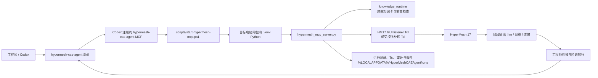

# HyperMesh CAE Agent 架构导览

> 面向 HyperMesh 17 的可迁移、可审计 CAE 工程师协同框架。当前以车门 CAD→CAE 前处理为已验证参考 Profile；本文说明“谁负责什么、状态在哪里、遇到问题先读什么”。

## 0. 产品定位与成熟度

`hypermesh-cae-agent` 的产品目标是把 Codex、MCP、HyperMesh Tcl、运行证据和工程师审核门组合成可复用的 CAE 协作框架，而不是把单一模型经验伪装成通用自动化。当前发行版已在车门 CAD→CAE 前处理上验证了连接、模型管理、中面、低风险清理、受控网格和连接审核链路；车门以外的模型仍需要工程师给出 Profile、标准和放行条件。

因此，下面出现的 `baobian`、`neiban`、`waiban`、车门功能配色和七阶段流程均属于当前车门参考 Profile。平台层可迁移，但这些工程规则不能被自动外推到其他零部件、行业或企业标准。

## 1. 先记住三条边界

1. **模型是 agent 的工作对象，代码是 harness。** Codex/模型负责理解意图、选择步骤、解释结果和提出工程师问题；代码负责提供确定性的工具、参数校验、Tcl 生成/执行、状态记录、回退和审计。
2. **MCP 不是 HyperMesh 本身。** MCP 只负责把 Codex 与已经打开的 HyperMesh 17 会话连接起来。几何、网格、视图和最终 `.hm` 文件仍由 HyperMesh 保存。
3. **Skill 工作流不等于跳过审核。** 当 agent 按当前 Skill/Profile 执行时，模型管理、中面和受控网格划分可以由 agent 主导；包边拓扑、质量修复和连接创建必须停在工程师交接点。连接候选可以自动扫描和局部展示，但点焊、胶粘、RBE2 只有在工程师批准后才能创建。
4. **原始 MCP 工具不是工作流放行器。** `hypermesh_mcp_server.py` 仍提供用于受控执行和排障的原始 Tcl 原语；它们不能判断工程语义、替代 Profile 参数或自动批准操作。对外承诺的行为来自 Skill 合同、知识卡和工程师门控，而不是绕过这些层的直接调用。

本文描述的是当前包的协作合同；具体模型的尺寸、容差、质量阈值、材料和求解器模板不能从组件名或颜色猜出来，必须由工程师给出或从已审计模型读回。

## 2. 一张图看懂运行链路

### 一次受控 Skill 工作流的实际顺序

1. Skill 先检查当前模型、HM 版本、输出目录、单位/标准和上一个阶段的验收状态。
2. MCP server 将请求转成结构化参数；需要经验时先调用知识路由，返回匹配卡片、前置条件、后置验证和是否必须审核。
3. server 生成带本次运行标识的 Tcl，写入运行目录；模型变更前先 Save As 到日期/阶段/操作命名的工作模型。
4. 通过 GUI listener（或明确选择的批处理入口）把 Tcl 送入 HyperMesh 17，轮询到完成、错误或超时。
5. 读取 HyperMesh 返回的数量/状态并写入日志、审计和 manifest。错误、缺输出或质量回归时停止当前阶段，不进行无界重试。
6. 把结果和待决问题交给工程师；只有工程师确认阶段出口后，agent 才能继续下一阶段。

## 3. 分层架构

| 层 | 目录/文件 | 主要职责 | 不应该放在这里 |
| --- | --- | --- | --- |
| 插件契约 | `.codex-plugin/plugin.json` | 插件名称、版本、Skill 入口和 Codex 展示元数据；版本是发布包命名的单一来源 | 机器绝对路径、模型文件、临时配置 |
| 安装与启动 | `scripts/install-local.ps1`、`check-environment.ps1`、`start-hypermesh-mcp.ps1`、`create-codex-mcp-snippet.ps1` | 在目标电脑创建本地虚拟环境、保存工作站路径、预检并注册唯一 MCP；提供没有 `codex` 命令时的手工 TOML 兜底 | 第二个同名 MCP、开发机路径、全局 Python 依赖假设 |
| MCP 运行时 | `backend/hypermesh-runtime/hypermesh_mcp_server.py` | FastMCP 工具、几何/网格/连接分析、Tcl 生成、GUI/批处理执行、运行记录和错误回退 | 把单个模型的 ID、组件名或工程师判断写死在通用循环里 |
| HM17 交互层 | `connector_review_panel.tcl` | 在已打开的 HM17 会话中以同一审核面板提供点焊/胶粘/RBE2 扫描、局部显示和经批准的连接创建；RBE2 宏以经校验的 Base64 形式内嵌于该文件 | 再引入独立旧版面板、绕过审核直接创建连接 |
| Codex 行为层 | `skills/hypermesh-cae-agent/SKILL.md` 及 `references/*.md` | 通用平台边界、阶段门、HM17 兼容性，以及当前车门 Profile 的包边/节点合并、配色、连接审查和文件生命周期规则 | 当前模型的临时事实、未经证实的阈值 |
| 知识层 | `knowledge/manifest.json`、`procedures/`、`rules/`、`cases/`、`sources/`；运行时为 `backend/knowledge_runtime/` | 可迁移 JSON 知识卡、来源/经验等级、版本和组件范围过滤；查询结果可写入证据文件 | 把聊天记录或模型快照当作无来源的永久规则 |
| 可复用 Tcl 资产 | `tcl/visualization/apply-functional-palette.tcl` | 经审查后按 component ID 应用功能配色，并立即回读验证颜色 | 不经模型核对就套用旧 ID 映射 |
| 发布校验 | `RELEASE-MANIFEST.json`、`scripts/verify-package.ps1` | 验证已交付文件的白名单、SHA-256、插件元数据和无源机路径 | 把 `docs/`、`runs/`、模型、日志、wheel 或测试塞进最小交付包 |

### 3.1 最小交付包文件逐项注释

下列文件是目标电脑真正会看到的核心内容；其余源仓库测试、历史记录和开发资料不随 ZIP 交付。

| 文件/目录 | 为什么要保留 | 什么时候会直接使用 |
| --- | --- | --- |
| .codex-plugin/plugin.json | Codex 插件身份、版本与 Skill 入口的唯一声明 | 安装/识别插件时 |
| README.md | 最短安装、连接、验收与排错路径 | 第一次在另一台电脑复现时 |
| ARCHITECTURE.md | 本文；解释目录职责、边界与推荐阅读顺序 | 想扩展或排错前 |
| requirements.txt | 目标机创建包内 Python 环境所需的最小依赖清单 | install-local.ps1 创建 .venv 时 |
| scripts/install-local.ps1 | 安装、迁移同名 MCP/Skill、写入目标机工作站配置 | 仅首次安装或升级时 |
| scripts/check-environment.ps1 | 检查 Python、Codex MCP、HM17 路径、端口和可选 batch 能力 | 安装后与每次大故障排查时 |
| scripts/start-hypermesh-mcp.ps1 | Codex 启动 MCP server 的唯一入口，强制使用包内 .venv | Codex 启动 MCP 时 |
| scripts/create-codex-mcp-snippet.ps1 | 在不能自动注册时生成可粘贴的 Codex MCP 配置片段 | MCP 注册受限时 |
| scripts/verify-package.ps1 | 核验发行包白名单、哈希、入口文件和无源机路径 | 收包或发布验收时 |
| backend/hypermesh-runtime/hypermesh_mcp_server.py | MCP 工具、Tcl 生成、运行记录、阶段 Save As 与异常处理 | 所有 Codex 到 HM17 的请求 |
| backend/hypermesh-runtime/connector_review_panel.tcl | 唯一的点焊、胶粘、RBE2 审核界面与 RBE2 内嵌宏 | P07 扫描、审核与创建 |
| backend/knowledge_runtime/ + knowledge/ | 可检索的流程、边界和工程师交接条件 | agent 需要选择流程或提示人工处理时 |
| skills/hypermesh-cae-agent/ | 给 Codex 的通用操作合同和当前车门 Profile 经验 | 用户以自然语言请求 HyperMesh CAE 工作流时 |
| tcl/visualization/apply-functional-palette.tcl | 已审查的功能配色执行资产 | 模型管理阶段已确认 component 映射后 |
| RELEASE-MANIFEST.json | 构包时生成的文件哈希和最小安装合同 | 对比交付 ZIP 是否被漏改或污染时 |

### 3.2 截图中四个连接文件的去向

下表对应早期运行目录中出现过的四个文件。它们不再是四套并行功能：交付包只保留一个统一的连接审核界面，避免重复 source、窗口互相覆盖或不同版本的 RBE2 创建逻辑混用。

| 原文件 | 当时的作用 | 现在的状态与替代位置 |
| --- | --- | --- |
| `circular_rbe2_review_panel.tcl` | 单独浏览圆形自由边、人工审核并创建 RBE2 | 已合并到 `backend/hypermesh-runtime/connector_review_panel.tcl` 的 RBE2 页；不再单独交付或 source。 |
| `spot_weld_review_panel.tcl` | 单独扫描、审核并创建点焊/胶粘 | 已合并到同一个 `connector_review_panel.tcl` 的点焊、胶粘页；不再单独交付或 source。 |
| `rbe2_two_circ_simple_version.tbc` | 历史 RBE2 TclPro 宏 | 宏的已校验 Base64 载荷与 SHA-256 注释嵌入统一面板；运行时不依赖外部 `.tbc` 文件。 |
| `hypermesh_mcp_server.py` | Codex 与 HyperMesh 之间的 MCP 服务端、Tcl 生成和运行记录 | 保留为 `backend/hypermesh-runtime/hypermesh_mcp_server.py`；它现在只加载统一面板，并继续负责扫描、阶段另存为、审计与异常回退。 |

### 3.3 Nastran/属性功能的边界

本包**不包含** Nastran 材料、厚度或属性分配自动化；废弃的 `nastran_property_contract` 源码、测试与缓存均不在源交付内容和发行 ZIP 中。唯一保留的 `NastranTemplateDir` / `HYPERMESH_NASTRAN_TEMPLATE_DIR` 配置，只在点焊 connector realization 时帮助 HyperMesh 找到其 FE 模板。它不是 Nastran 属性功能，删除它会导致点焊创建失效。

## 4. 当前已验证的车门参考流程与责任边界

阶段状态只能按 `not_started → agent_running → engineer_action_required / engineer_decision_required → accepted` 推进；agent 不能替工程师把后两种状态改成 `accepted`。

下表说明当前车门 Profile 的成熟度，不承诺其已适配所有零部件、行业和企业标准。对其他模型，agent 只能在工程师提供 Profile、参数和验收条件后执行受控操作。

| 阶段 | agent 可以做 | 必须由工程师决定/验收 |
| --- | --- | --- |
| P01 模型管理与组织 | 导入/清点、组件命名、功能配色、参考几何归类和审计 | 语义不明的组件、特殊命名/导出要求 |
| P02 中面抽取 | 区分未网格化 solid/surface、判断可确认的单层面、抽中面并保留来源/厚度映射 | 层数、厚度或结构关系无法从模型确定的例外 |
| P03 几何清理 | 低风险 Auto Cleanup、问题扫描、候选修复和前后统计 | 关键拓扑、包边相关特征、复杂删除/重构 |
| P04 包边 | 只读取工程师交付的结果、记录边界和参考网格 | 包边几何、四边形主导、局部重划和拓扑修复；agent 不自动改包边 |
| P05 网格划分 | 按组件独立运行 BatchMesh/受控 Automesh 回退，轮询、保存和汇总 | 网格尺寸、质量标准和例外区域 |
| P06 网格检查/修复 | 检查、定位、截图/证据、提出局部 Combine/Split/Smooth/Replace/Equivalence 候选 | 质量是否合格、修复顺序、包边接口和最终放行 |
| P07 连接 | 扫描、分级、局部高亮/放大、记录并按批准提交 | 每个点焊、胶粘、RBE2 的真实有效性、补加和创建确认 |

### 连接插件的特别约束

- 点焊和胶粘的参考几何优先集中到 `connector_ref_spot_weld`、`connector_ref_glue`；兼容旧别名，但不能把板件网格或已实现连接器误搬进去。
- RBE2 默认以 5 mm 圆心容差先显示 `paired_circles`，再显示 `ambiguous_pair` 和 `single_circle`；候选浏览必须只显示相关 component/网格并局部聚焦。
- 审核 UI 的“通过/拒绝/人工补加”是状态记录，不等于自动批准；创建前必须保存恢复模型，创建后读取审计和结果数量。
- 切换到另一 .hm 时必须丢弃旧模型的候选和 UI 状态；RBE2 候选若其代表节点已由现有 RBE2 使用，显示为“已存在”并锁定。宏在创建实体后仍返回错误时，界面必须显示 warning 并要求工程师查看 audit，而不能报告无条件成功。

## 5. 核心文件阅读索引（推荐阅读顺序）

### 5.1 先读这些（交付包中的最小主路径）

| 顺序 | 文件 | 阅读时要回答的问题 |
| ---: | --- | --- |
| 1 | `README.md` | 目标电脑需要什么、如何安装、如何首次 source listener、如何验收 |
| 2 | `ARCHITECTURE.md` | 下面这张表和运行边界如何串起来 |
| 3 | `.codex-plugin/plugin.json` | 插件名/版本、Skill 从哪里加载、Codex 展示什么 |
| 4 | `scripts/install-local.ps1` | 安装器如何创建 `.venv`、迁移同名 MCP、保存工作站配置并安全回滚 |
| 5 | `scripts/check-environment.ps1` | GUI、batch、Python、端口、模板和状态目录怎样预检 |
| 6 | `scripts/start-hypermesh-mcp.ps1` | Codex 启动 MCP 时如何定位包根、注入环境变量并只使用包内 Python |
| 7 | `skills/hypermesh-cae-agent/SKILL.md` | 通用平台边界、当前车门 Profile 中 agent 可以做什么，以及哪些操作必须停下来交给工程师 |
| 8 | `skills/hypermesh-cae-agent/references/workflow-contract.md` 与 `vehicle-door-full-workflow.md` | 每个阶段的输入、出口、Save As 和异常处理细节；后者是当前车门验证案例 |

### 5.2 要改运行能力时

| 顺序 | 文件 | 用途 |
| ---: | --- | --- |
| 9 | `backend/hypermesh-runtime/hypermesh_mcp_server.py` | MCP 工具的公共入口；先看已有工具和运行目录辅助函数，再加新能力 |
| 10 | `backend/knowledge_runtime/router.py`、`store.py` | 知识卡如何按意图、HM 版本、组件范围和风险模式排序并留下证据 |
| 11 | `knowledge/manifest.json` 和对应 JSON 卡 | 知识版本、来源等级、前置/后置检查、工程师审核标记 |
| 12 | `backend/hypermesh-runtime/connector_review_panel.tcl` | 唯一的点焊/胶粘/RBE2 审核窗口：统一扫描、局部显示、人工决策、审计与创建入口 |
| 13 | `tcl/visualization/apply-functional-palette.tcl` | 配色模板；必须先由 agent 填充当前模型的 component ID 映射 |

### 5.3 要发布或迁移到另一台电脑时

| 顺序 | 文件 | 用途 |
| ---: | --- | --- |
| 14 | `RELEASE-MANIFEST.json` | 已交付文件的路径和 SHA-256 合同；不手工编辑 |
| 15 | `scripts/verify-package.ps1` | 检查缺失、越权文件、源机器路径、清单与插件元数据一致性和 SHA-256 |
| 16 | `README.md` 的“发布包校验” | 目标电脑从 ZIP 或 Git clone 获得该最小包后，应执行的正式验收路径 |

## 6. 状态和文件放在哪里

| 状态 | 默认位置/载体 | 生命周期与规则 |
| --- | --- | --- |
| 静态程序 | 包根目录及其子目录 | 随 ZIP 迁移；不写入当前模型事实 |
| 工作站配置 | 包内 `.local/workstation.json` | 由安装器在目标机生成；保存 HM GUI/batch、点焊连接器所需的 Nastran FE 模板和 runs 目录的本机路径。模板仅用于 connector realization，不涉及材料、厚度或属性赋值；不复制到另一台电脑 |
| Python 环境 | 包内 `.venv` | 由目标机安装器创建；启动器强制使用它，避免依赖全局 Python |
| 运行记录 | `%LOCALAPPDATA%/HyperMeshCAEAgent/runs`，可由 `HYPERMESH_CAE_AGENT_RUNS_DIR` 改写 | 保存 Tcl、请求/响应、审计、知识命中、错误和报告；模型变更前后均应可追溯 |
| 阶段模型 | 工程师指定的模型输出目录 | 每个大阶段 Save As 新 `.hm`；原始输入和已验收输出不得自动删除 |
| 知识索引 | 源仓库 `knowledge/index/knowledge.db`（可重建） | 交付包只需 JSON 卡和运行时；没有索引时 router 回退到文件扫描 |
| 发布产物 | 源仓库外的 `delivery/` | 只交付版本化 ZIP；不要把开发目录、模型、runs、`.venv` 或临时备份当作产品交给别人 |

## 7. 扩展规则（给后续 agent/开发者）

### 新增一个 MCP 能力

1. 先写输入/输出契约和失败分类；能只读就不要先做模型变更。
2. 在 `hypermesh_mcp_server.py` 中复用运行目录、Save As、超时轮询和审计辅助函数；不要把流程塞进自然语言提示或单一模型 ID。
3. 涉及 HM17 GUI 的部分使用可审计 Tcl 模板；把 Tcl 路径、参数、输出和验证结果写入 run 记录。
4. 涉及工程判断的能力返回 `engineer_review`/`engineer_action_required`，不能静默执行。
5. 为正常路径、连接断开、Tcl 错误、超时、缺失输出和重复执行各加一个可复现测试。

### 新增 Tcl 面板或宏

- 面板由 MCP 按本次运行填充配置后加载；不要让用户再打开旧版独立页面。
- HM17 对 Tcl 编码敏感：可见中文使用现有的 UTF-8/hex 解码模式，避免乱码。
- 浏览候选时先恢复全显示，再 mask 目标 component/网格，最后局部 zoom/highlight；退出或切换候选要能恢复全模型。
- RBE2 宏只保留在 `connector_review_panel.tcl` 的经校验内嵌载荷中；创建前清 node mark、保存恢复模型，创建后读取审计。成功候选标记为 `applied`，模型中已存在者标记为 `existing` 并锁定；宏报错但已有新实体时必须保留并向工程师显示 warning，重试只处理失败候选。

### 新增知识卡

- 放在 `knowledge/procedures`、`rules`、`cases` 或 `sources`，遵守 `knowledge/schemas` 中的结构。
- 必须写 HM 版本、适用组件/范围、来源等级、前置条件、验证项和 `requires_engineer_review`。
- 交付包不携带开发机生成的 SQLite 索引；先确认 JSON 卡能被文件扫描回退命中。若维护者开发环境另有索引构建工具，索引生成与查询必须在该源仓库中单独验证，不能把生成产物带入最小交付包。

## 8. 故障定位地图

| 现象 | 先看 | 典型处理 |
| --- | --- | --- |
| 安装器拒绝迁移同名 MCP/Skill | `install-local.ps1` 输出、`codex mcp get <name> --json` | 先确认它是否确实属于本包；不确定时保留并交给工程师，不要强删 |
| Codex 看不到工具 | `check-environment.ps1 -AsJson`、`codex mcp get hypermesh-cae-agent` | 检查唯一注册、`.venv` 和工作站配置，重启 Codex 后再试 |
| MCP 启动但 HM 不响应 | `start-hypermesh-mcp.ps1`、运行目录诊断、HM listener Tcl | 在 HM17 中 source 本次生成的 listener Tcl，确认端口和会话；不要复用旧 runs 中的 Tcl |
| BatchMesh/Automesh 报错或循环 | server 的超时/异步状态、当前阶段 audit | 停止当前组件，保存现状并报告；按批准的局部回退重试一次，不做无界重试 |
| 连接候选数量异常 | 参考 component 清单、知识命中证据、对应审核面板 | 先核对参考几何归类和全模型扫描范围，再让工程师逐项审核 |
| 发布包验证失败 | `verify-package.ps1 -AsJson` 的 `missing/forbidden/checksum` | 删除开发产物、修正白名单或重建 ZIP；不要手工编辑 `RELEASE-MANIFEST.json` |

## 9. 最小可复现检查

在一台新电脑上，以下顺序应能复现核心链路：

1. 解压版本化 ZIP，按 `README.md` 的安装命令运行 `scripts/install-local.ps1`，提供本机 HM17 GUI 路径（需要批处理时再提供 batch 路径）。
2. 运行 `scripts/check-environment.ps1 -AsJson`，确认 Python、MCP 注册、HM17 可执行文件和 Nastran 模板状态。
3. 重启 Codex；在 HyperMesh 17 打开可丢弃模型，source Codex 为本次会话生成的 listener Tcl。
4. 先做只读连接测试，再请求模型管理/中面/网格阶段；每个阶段确认 Save As 输出、Tcl、audit 和 manifest 都存在。
5. 到 P07 时先扫描并打开统一审核面板；没有工程师明确批准，不创建连接。
6. 若要验收迁移完整性，运行包内 `scripts/verify-package.ps1 -PackageRoot <解压目录>`；`ready` 为 `true` 后再开始目标模型测试。

达到“能安装、能注册唯一 MCP、能 source listener、能完成只读 ping、能写运行记录且不携带源机器路径”才算最小可复现；模型质量和工程交付仍需按阶段由工程师验收。

## 10. 变更后的验证清单

- 文档只引用相对路径或目标机变量，不写开发机绝对路径。
- 修改运行时后先跑对应 Python 单元测试，再跑安装/启动/发布脚本测试。
- 修改发布白名单后重新构包，不手改清单或 ZIP。
- 发布前确认包内没有模型、`runs`、`.venv`、wheel、测试和源仓库 `docs`；`ARCHITECTURE.md` 是唯一随包交付的架构导览。
- 将变更理由保持在精简的架构说明、Skill 参考卡和可验证测试中，而不是把历史聊天全文塞进运行时 Skill。
